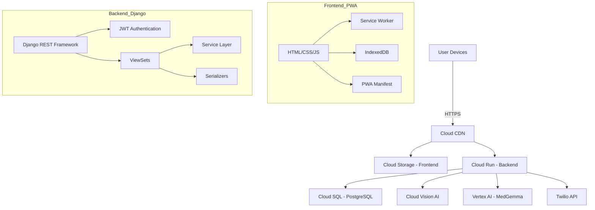
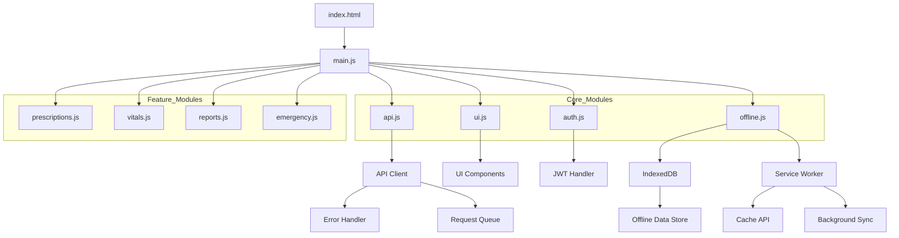
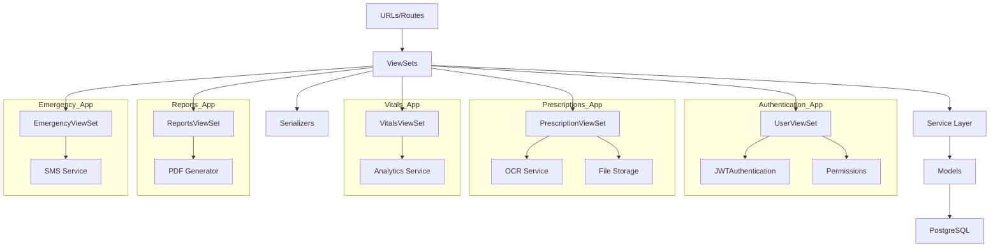
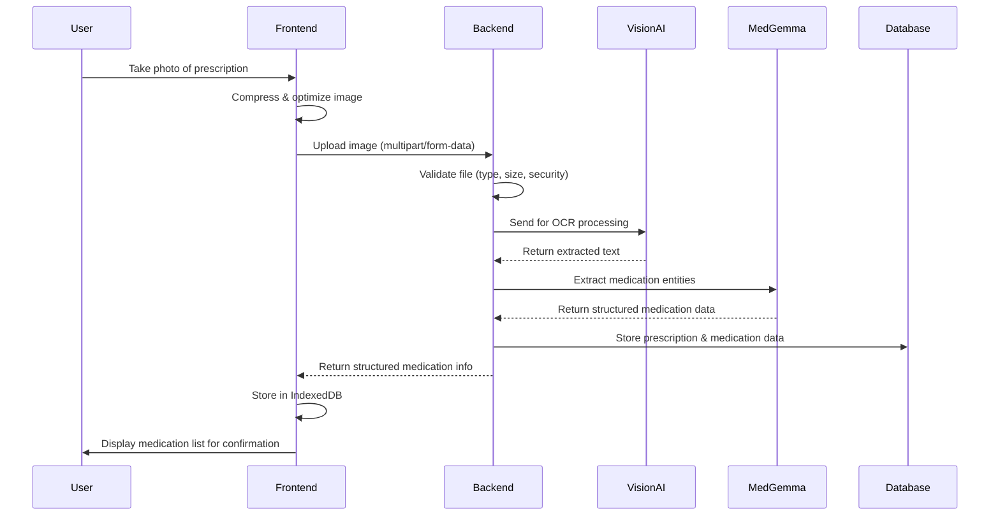
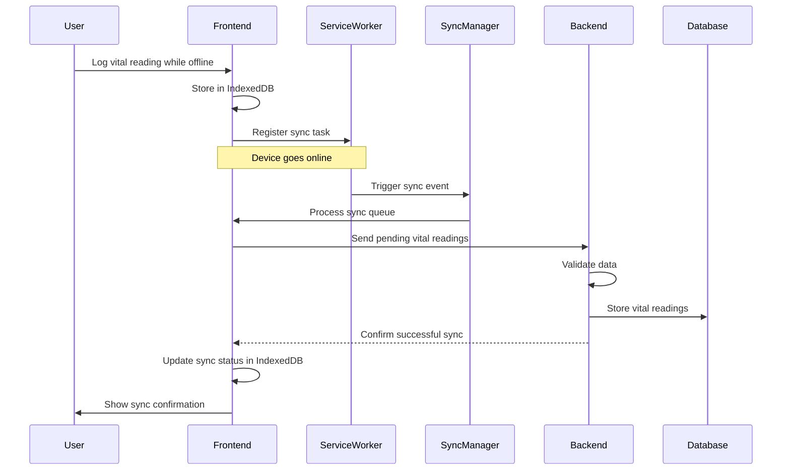
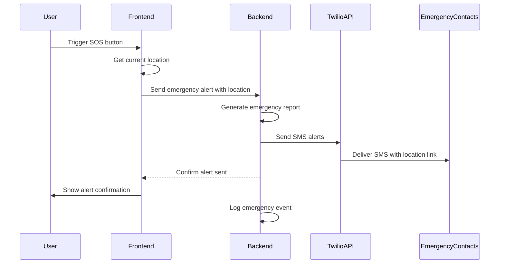
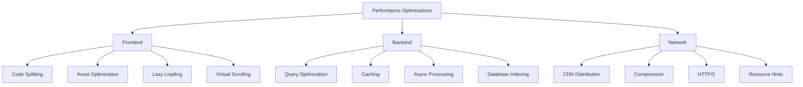
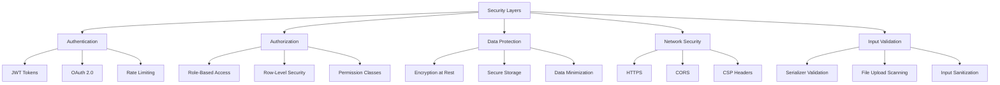

# Helthana:Your Health Guide (دليلك الصحي)

A Progressive Web App (PWA) designed to transform healthcare management in Egypt by providing an intelligent, accessible digital health companion for patients with chronic conditions.

## 🩺 Problem Statement

Egyptian patients with chronic diseases face significant challenges:

- **📝 Illegible Prescriptions**: 78% of handwritten prescriptions contain at least one error, leading to medication mistakes
- **📊 Inconsistent Tracking**: 62% of patients don't track their vitals regularly, making disease management difficult
- **🏥 Inefficient Doctor Visits**: 85% of consultations rely on patient memory rather than accurate data
- **📱 Digital Divide**: 65% of elderly patients struggle with complex health apps, creating barriers to digital health adoption
- **🔌 Connectivity Issues**: Intermittent internet access in many areas prevents reliable use of cloud-based health solutions

## 💡 Our Solution

"Your Health Guide" is an offline-first Progressive Web App that combines AI capabilities with a simple, intuitive interface to solve these challenges:

### Key Differentiators

- **AI-Powered Prescription Scanner**: Convert handwritten prescriptions into digital records with 95%+ accuracy
- **Voice-First Interface**: Full support for Egyptian Arabic voice commands
- **Offline-First Design**: Works without internet connectivity using IndexedDB and background sync
- **Data Ownership**: Patients control who accesses their health information
- **Multigenerational Design**: Accessible to users of all ages and tech-literacy levels

## ✅ MVP Features Implemented

### 1. Intelligent Prescription Scanner

- Camera-based prescription scanning with image optimization
- OCR processing with medication name, dosage, and instruction extraction
- Manual editing capabilities for OCR results
- Secure image storage with encryption

### 2. Smart Vitals Tracker

- Quick logging of health metrics (blood pressure, glucose, etc.)
- Visual trend analysis with charts and graphs
- Abnormal reading detection and alerts
- Offline data storage with background sync

### 3. Health Report Generator

- PDF report generation with WeasyPrint
- Comprehensive health data visualization
- Doctor-friendly formatting
- Secure sharing options

### 4. Emergency SOS System

- One-tap emergency alerts with location sharing
- Automated messages to emergency contacts
- Medical ID access for first responders
- Alert history and status tracking

### 5. Offline-First Architecture

- Complete offline functionality with IndexedDB
- Intelligent sync with conflict resolution
- Offline queue management and prioritization
- Network status detection and user feedback

## 🚀 Planned Features

### 1. AI Health Insights

- Medication interaction warnings
- Health trend analysis with personalized recommendations
- Nutrition and lifestyle guidance
- Early warning detection for abnormal patterns

### 2. Voice Assistant Integration

- Egyptian Arabic voice command processing
- Voice-guided navigation for visually impaired users
- Voice-based vitals logging and medication reminders
- Natural language processing for health queries

### 3. Community Support Network

- Anonymous condition-specific support groups
- Verified healthcare professional Q&A
- Resource sharing and local healthcare information
- Caregiver coordination tools

## 🔧 Technical Architecture

### System Architecture Overview



### Frontend Architecture (Vanilla JavaScript PWA)



### Backend Architecture (Django REST Framework)



### Data Flow Diagrams

#### 1. Prescription Processing Flow



#### 2. Offline Synchronization Flow



#### 3. Emergency Alert Flow



### Technology Stack Details

#### Frontend (Vanilla JavaScript PWA)

- **Framework**: Vanilla JavaScript (ES6+) with Vite for bundling
- **Styling**: Tailwind CSS with DaisyUI component library
- **PWA Features**:
  - Service Workers for offline caching
  - IndexedDB for structured data storage
  - Background Sync for offline operations
  - Push API for notifications
  - Web App Manifest for installation
- **Architecture**: Modular component-based structure with ES6 modules

#### Backend (Django REST Framework)

- **Framework**: Django 4.2 with Django REST Framework
- **Database**: PostgreSQL with row-level security and encryption
- **Authentication**: JWT + OAuth 2.0 with token refresh
- **Cache**: Redis for session management and rate limiting
- **AI/ML**:
  - Google Cloud Vision API for OCR
  - MedGemma via Vertex AI for medical entity extraction
  - Speech-to-Text API for voice commands
- **File Storage**: Cloud Storage with secure access controls
- **Messaging**: Twilio API for emergency SMS alerts

### Performance Optimization



### Security Architecture



## 🛠️ Project Structure

```text
your-health-guide/
├── backend/                 # Django REST API
│   ├── health_guide/       # Main Django project
│   │   ├── settings/       # Environment-specific settings
│   │   └── ...
│   ├── apps/               # Django applications
│   │   ├── authentication/ # User auth & JWT
│   │   ├── prescriptions/  # Prescription scanning
│   │   ├── vitals/         # Health metrics tracking
│   │   ├── reports/        # PDF generation
│   │   └── emergency/      # SOS functionality
│   ├── pyproject.toml
│   └── uv.lock
├── frontend/               # PWA frontend
│   ├── public/            # Static HTML files
│   │   ├── index.html     # Landing page
│   │   ├── dashboard.html # Main app interface
│   │   └── manifest.json  # PWA manifest
│   └── src/
│       ├── styles/        # Tailwind CSS
│       └── scripts/       # JavaScript modules
├── docs/                  # Documentation
├── docker-compose.yml     # Local development
├── Dockerfile            # Container configuration
└── README.md
```

## 🚀 Quick Start

### Prerequisites

- Python 3.12+
- uv
- Node.js 16+
- PostgreSQL (for production)
- Docker (optional)

### Backend Setup

```bash
# Install dependencies and create virtual environment
uv sync

# Run migrations
uv run python manage.py makemigrations
uv run python manage.py migrate

# Create superuser (optional)
uv run python manage.py createsuperuser

# Run development server
uv run python manage.py runserver
```

### Frontend Setup

```bash
# Navigate to frontend directory
cd frontend

# Install dependencies
npm install

# Run development server with Vite
npm run dev

# Or build for production
npm run build
npm run preview
```

### Docker Setup (Alternative)

```bash
# Build and run with Docker Compose
docker-compose up --build

# Access the application
# Frontend: http://localhost:8080
# Backend API: http://localhost:8000
# Admin Panel: http://localhost:8000/admin
```

## 📱 PWA Features

- **Offline Support**: Complete functionality without internet connection
- **Installable**: Add to home screen for app-like experience
- **Responsive**: Works on all device sizes
- **Push Notifications**: Medication reminders and alerts
- **Background Sync**: Data synchronization when connection is restored
- **File Access**: Camera and storage access for prescription scanning
- **Geolocation**: Location sharing for emergency alerts

## 🔒 Security Features

- **Data Encryption**: Sensitive health information encrypted at rest
- **JWT Authentication**: Secure token-based authentication
- **Permission Management**: Fine-grained access control
- **Input Validation**: Comprehensive validation for all user inputs
- **File Upload Security**: Secure file handling and validation
- **CSRF Protection**: Cross-site request forgery prevention
- **Content Security Policy**: Protection against XSS attacks

## 🌐 Deployment Options

### GitHub Docker Deployment

- Automated Docker builds for both backend and frontend
- GitHub Container Registry (GHCR) for image storage
- Integration testing with full application stack
- Release management with tagged Docker images

### Google Cloud Platform

- Cloud Run for containerized backend
- Cloud Storage for static frontend hosting
- Cloud SQL for PostgreSQL database
- Vision AI and Vertex AI for AI/ML features
- Cloud CDN for global content delivery

## 👥 Team

- **Khaled Mahmoud**: Project Lead & Backend Developer & Ai Engineer &software Archticet
- **Gasser Mohammed**: Frontend Developer & Deployment engineer & UX Designer

## 📄 License

This project is licensed under the MIT License - see the [LICENSE](LICENSE) file for details.

## 🙏 Acknowledgments

- Google Cloud Platform for AI/ML services
- Tailwind CSS and DaisyUI for the beautiful UI
- Django and Django REST Framework for the robust backend
- The open-source community for the amazing tools and libraries

---

Made with ❤️ for the people of Egypt.
