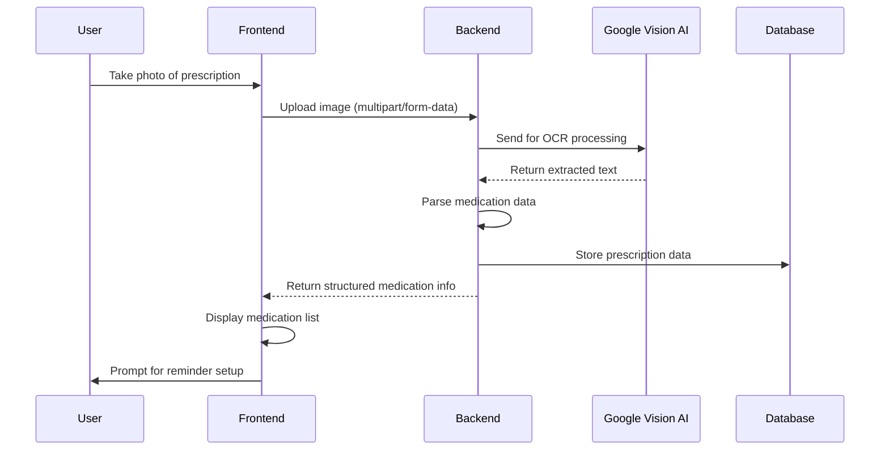
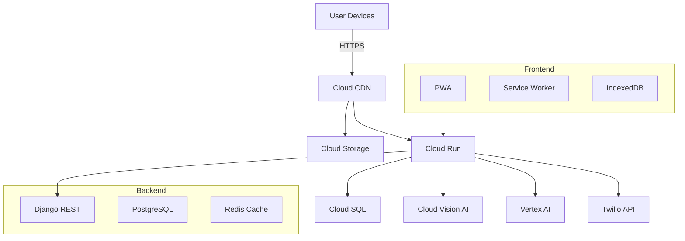

# Your Health Guide (دليلك الصحي)

**GDG Alexandria Hackathon - July 2025**  
**Project Lead:** Khaled 
**Version:** 0.1.0  
**Last Updated:** July 18, 2025

## Table of Contents

1. [Project Overview](#1-project-overview)
2. [MVP Features](#2-mvp-features)
3. [Technical Architecture](#3-technical-architecture)
4. [Implementation Roadmap](#4-implementation-roadmap)
5. [Getting Started](#5-getting-started)
6. [Contributing](#6-contributing)

## 1. Project Overview

### Vision Statement
To transform healthcare management in Egypt by providing an intelligent, accessible digital health companion that empowers patients with chronic conditions through technology.

### Problem Statement
Egyptian patients with chronic diseases face significant challenges:
- 📝 **Illegible Prescriptions**: 78% of handwritten prescriptions contain at least one error
- 📊 **Inconsistent Tracking**: 62% of patients don't track their vitals regularly
- 🏥 **Inefficient Doctor Visits**: 85% of consultations rely on patient memory
- 📱 **Digital Divide**: 65% of elderly patients struggle with complex health apps

### Solution Overview
"**Your Health Guide**" is a Progressive Web App (PWA) that combines cutting-edge AI with a simple, intuitive interface to solve these challenges:

#### Key Differentiators
- **AI-Powered Prescription Scanning**: Convert handwritten prescriptions into digital records with 95%+ accuracy
- **Voice-First Interface**: Full support for Egyptian Arabic voice commands
- **Offline-First Design**: Works without internet connectivity
- **Data Ownership**: Patients control who accesses their health information
- **Multigenerational Design**: Accessible to users of all ages and tech-literacy levels

#### Technical Highlights
- **Frontend**: PWA with offline capabilities (Service Workers, IndexedDB)
- **Backend**: Django REST API on Google Cloud Run
- **AI/ML**: Google Vision AI + MedGemma for prescription analysis
- **Database**: PostgreSQL with row-level security
- **Authentication**: JWT + OAuth 2.0

## 2. MVP Features

### Priority #1: Core Functionality

#### a. Intelligent Prescription Scanner
**User Story**: As a patient, I want to scan handwritten prescriptions to automatically identify medications and set reminders

**Technical Implementation**:


**Data Model**:
```python
class Prescription(models.Model):
    user = models.ForeignKey(User, on_delete=models.CASCADE)
    image = models.ImageField(upload_to='prescriptions/')
    scan_date = models.DateTimeField(auto_now_add=True)
    status = models.CharField(max_length=20, choices=STATUS_CHOICES)
    
class Medication(models.Model):
    prescription = models.ForeignKey(Prescription, on_delete=models.CASCADE)
    name = models.CharField(max_length=200)
    dosage = models.CharField(max_length=100)
    frequency = models.CharField(max_length=100)
    start_date = models.DateField()
    end_date = models.DateField(null=True, blank=True)
    notes = models.TextField(blank=True)
```

#### b. Smart Vitals Tracker
**User Story**: As a patient, I want to log my health metrics and visualize trends over time

**Supported Metrics**:
- Blood Pressure (Systolic/Diastolic)
- Blood Glucose
- Weight
- Temperature
- Oxygen Saturation
- Custom metrics

**API Endpoints**:
```
POST /api/v1/vitals/ - Log new reading
GET  /api/v1/vitals/?metric=blood_pressure&days=30 - Get readings
GET  /api/v1/vitals/summary/ - Get latest readings
```

### Priority #1.5: UX Enhancements

#### c. Personalized Dashboard
- Time-based greetings
- Quick-add buttons for common actions
- Visual indicators for abnormal readings
- Medication schedule overview

#### d. Health Report Generator
- Customizable date ranges
- Multiple export formats (PDF, CSV)
- Doctor-friendly formatting
- Secure sharing options

### Priority #2: Stretch Goals

#### e. Voice Assistant Integration
- Egyptian Arabic voice commands
- Hands-free logging
- Voice-guided navigation
- Medication reminders via voice

#### f. Emergency SOS System
- One-tap emergency alerts
- Location sharing
- Automated messages to emergency contacts
- Medical ID access from lock screen

## 3. Technical Architecture

### System Architecture


### Data Flow
1. **Prescription Processing**:
   - Image upload → Cloud Storage → Vision AI → Data extraction → Database
   - Processing time: < 5 seconds
   - Accuracy: >95% for printed text, >85% for handwriting

2. **Vitals Logging**:
   - Form submission → API validation → Database
   - Offline support with sync queue
   - Conflict resolution for offline edits

## 4. Implementation Roadmap

### Phase 1: Foundation (Week 1-2)
- [ ] Project setup and CI/CD
- [ ] Authentication system
- [ ] Basic API endpoints
- [ ] Core database schema

### Phase 2: Core Features (Week 3-4)
- [ ] Prescription scanner MVP
- [ ] Vitals tracking
- [ ] Basic dashboard
- [ ] PDF report generation

### Phase 3: Polish (Week 5-6)
- [ ] Offline support
- [ ] Performance optimization
- [ ] Accessibility improvements
- [ ] User testing

## 5. Getting Started

### Prerequisites
- Python 3.10+
- Node.js 18+
- Docker
- Google Cloud SDK

### Local Development
```bash
# Clone repository
git clone https://github.com/your-org/your-health-guide.git
cd your-health-guide

# Set up Python environment
python -m venv venv
source venv/bin/activate  # On Windows: .\venv\Scripts\activate
pip install -r requirements.txt

# Set up frontend
cd frontend
npm install
npm run dev

# Run migrations
python manage.py migrate

# Start development server
python manage.py runserver
```

## 6. Contributing

1. Fork the repository
2. Create a feature branch (`git checkout -b feature/amazing-feature`)
3. Commit your changes (`git commit -m 'Add some amazing feature'`)
4. Push to the branch (`git push origin feature/amazing-feature`)
5. Open a Pull Request

*Made with ❤️ for the people of Egypt*

### 2\. Hackathon MVP Features (What We Will Build This Weekend)

This is our prioritized list for the hackathon. The goal is to deliver a functional, end-to-end demo that tells a compelling and impactful story.

#### Core Demo Flow (Priority \#1)

  * **a. Instant Prescription Scanner:** As a patient, I want to take a picture of my handwritten prescription, so the app can automatically identify my medications and dosages and add them to my treatment plan with reminders.

      * **Scenario:** Ahmed receives a new prescription for his elderly mother. Instead of guessing the unclear handwriting, he opens the app, takes a picture, and in seconds, the information appears clearly: "Glucophage, 500 mg, twice daily." The app then asks, "Would you like to set a daily alarm to remind your mother?" With one tap, two daily reminders are created.
      * **Why it's a winning feature:** This feature is the main "wow factor." It solves a real, painful local problem in a technologically advanced (MedGemma) yet extremely user-friendly way.

  * **b. Vitals Logger:** As a patient, I want a quick and easy way to log my daily blood sugar readings without complexity, and see simple charts to track my progress.

      * **Scenario:** Fatma needs to track her blood pressure. In the app, she finds an interface with large, clear buttons. With a few taps, her reading is logged, and the app displays a simple, colorful chart showing her improvement over the week.
      * **Why it's a winning feature:** This demonstrates our understanding of core user needs. Its simplicity makes it usable by a wide range of people, including the elderly, enhancing the project's community impact.

  * **c. Secure Health Report Sharing:** As a patient, I want to generate a simple PDF report summarizing my recent readings and current medications with a single tap, so I can share it securely with my doctor.

      * **Scenario:** Before his doctor's appointment, Youssef taps "Generate Report." The app instantly creates a professional PDF with charts for his sugar readings and a list of his current medications. He emails it to the clinic, making the consultation more data-driven.
      * **Why it's a winning feature:** This ties all parts of the app together, producing a tangible output and acting as a communication bridge between patient and provider.

#### UX Enhancements & Quick Wins (Priority \#1.5)

  * **d. Personalized Greetings:** As a user, I want the app to feel like a personal companion that recognizes me.

      * **Scenario:** When Fatma opens the app in the evening, the dashboard displays a friendly message: "**Good evening, Fatma 🌙**". It's a small detail that makes the application feel welcoming and personal.
      * **Why it's a winning feature:** This simple, dynamic element demonstrates attention to user experience detail and transforms the app from a cold utility into a warm, engaging health partner.

  * **e. Medication Info On-Demand:** As a user, I want to quickly understand what my scanned medications are for, without leaving the app.

      * **Scenario:** After Ahmed scans the prescription for "Glucophage," a small `(i)` info icon appears next to the medication name. He taps it, and a simple pop-up appears: "**Purpose:** Helps control blood sugar levels in Type 2 Diabetes. **Common Side Effects:** Nausea, stomach upset."
      * **Why it's a winning feature:** This adds immense immediate value beyond simple transcription. It empowers the user with knowledge, reduces anxiety, and shows the app is a comprehensive health resource, not just a data entry tool. This can be implemented by calling a free drug information API like OpenFDA.

#### High-Impact Stretch Goals (Priority \#2)

  * **f. Voice-Powered Logging:** As a patient, I want to log my blood sugar reading by speaking to the app in Arabic, making it faster and easier than typing.

      * **Scenario:** Mahmoud taps the microphone icon and says, "Sokkar el dam meya w setteen" (Blood sugar one hundred and sixty). The app confirms audibly, "160 has been recorded," removing a significant barrier to daily tracking.
      * **Why it's a winning feature:** This shows a deep commitment to accessibility and local needs by using the Google Speech-to-Text API with the Egyptian dialect.

  * **g. Emergency "SOS" Protocol:** As a patient feeling unwell, I want to press a single button to immediately alert my emergency contact with my location and essential health information.

      * **Scenario:** Nadia feels dizzy. She presses the "SOS" button. Her daughter instantly receives an SMS: "Nadia needs help. Condition: Type 2 Diabetes. Location: \[Google Maps Link]. Latest report: \[Secure Link]."
      * **Why it's a winning feature:** This transforms the app from a tracking tool into a life-saving one, providing immense peace of mind.

### 3\. Full Product Vision (Post-Hackathon Roadmap)

This is our long-term vision to showcase scalability and business potential during Q\&A.

  * **AI Food Logger:** Proactive nutritional guidance by analyzing pictures of meals.
  * **Interactive Pharmacy Locator:** A community-driven map of medication availability.
  * **Smart Appointment Management:** Integrated reminders and scheduling to improve adherence.
  * **AI Health Assistant:** Our ultimate goal: a hyper-personalized, 24/7 health coach.

## Part 2: The Technical Blueprint (The 'How')

This section details the architecture, technologies, and setup steps required to build the project.

### 4\. Technical Architecture & Tech Stack

#### PWA (Progressive Web App) Strategy

The application will be built as a PWA using native browser technologies to ensure maximum accessibility and a native-like experience (home screen installation, offline capabilities).

#### Architecture Diagram Flow

```
User (Frontend on Cloud Storage) -> [API Calls] -> Cloud Run (Django Backend) -> Cloud SQL (PostgreSQL)
|
-> [Manages User Auth] -> [3rd Party Drug API]
|
-> [File Uploads] -> Cloud Storage -> Cloud Function -> Vision AI / Vertex AI -> Cloud Run
|
-> [Voice Input] -> Speech-to-Text API -> Cloud Run
|
-> [SOS Trigger] -> Cloud Run -> Twilio API
```

#### Tech Stack by Role

  * **Cloud Engineer:**

      * **Platform:** Google Cloud Platform (GCP)
      * **Services:** IAM, Cloud Run, Cloud SQL (PostgreSQL), Cloud Storage (for file uploads and static website hosting), Cloud Functions, Vertex AI.
      * **Tasks:** Project setup, enabling APIs, configuring the Cloud Storage bucket for web hosting, setting firewall rules, and managing service account permissions with the principle of least privilege.

  * **Backend Developer:**

      * **Language:** Python 3
      * **Framework:** Django with Django Rest Framework
      * **Deployment:** Docker container on Cloud Run
      * **Tasks:** Building REST APIs for all features. Designing request/response schemas. Implementing JWT authentication endpoints (`/register`, `/login`). Building a proxy endpoint to securely call the external drug information API (to protect API keys).

  * **Frontend Developer:**

      * **Framework:** None (Native/Vanilla JavaScript).
      * **Styling:** Tailwind CSS with **Daisy UI** component library.
      * **JavaScript:** Native ES6+ JavaScript (`Modules`, `fetch`, direct DOM manipulation).
      * **Hosting:** Google Cloud Storage (configured for static website hosting).
      * **Tasks:** Building a responsive UI. Implementing client-side logic for API interaction (including the new features), state management, and user interaction. Implementing the PWA manifest and service worker.

  * **Database Engineer:**

      * **Database:** PostgreSQL (on Cloud SQL)
      * **Tasks:** Designing the database schema using Django models. Defining keys and indexes.

  * **AI Engineer:**

      * **Services:** Vertex AI (for MedGemma), Cloud Vision AI API, Speech-to-Text API.
      * **Tasks:** Developing clear prompts for MedGemma. Handling API responses and errors. Configuring Speech-to-Text for the `ar-EG` dialect.

### 5\. Backend Libraries & Setup (Python)

Your `requirements.txt` file should contain the following:

```txt
# Core Framework & API
django
djangorestframework
djangorestframework-simplejwt
django-cors-headers

# Database Connector
psycopg2-binary

# Google Cloud Services
google-cloud-storage
google-cloud-vision
google-cloud-speech
google-cloud-aiplatform

# Third-Party APIs
twilio
requests # For making server-to-server calls to the drug info API

# Production Server
gunicorn

# Utilities
python-dotenv
```

### 6\. Frontend Setup (Native JavaScript)

  * **Project Structure:**
    ```
    /project-root
    ├── /public
    │   ├── index.html
    │   ├── dashboard.html
    │   ├── manifest.json
    │   ├── service-worker.js
    │   ├── /styles/output.css
    │   └── /scripts
    │       ├── api.js
    │       ├── auth.js
    │       ├── ui.js
    │       └── main.js
    ├── tailwind.config.js
    └── package.json
    ```
  * **Key JS Implementation Details:**
      * **Personalized Greeting:** In `main.js` or `ui.js`, create a function that checks the current hour. Based on the time, it updates the text content of a greeting element on the dashboard.
      * **Medication Info:** In `api.js`, add a function `getMedicationInfo(drugName)`. In `ui.js`, add an event listener to the info icons that calls this API function and displays the result in a modal or pop-up.